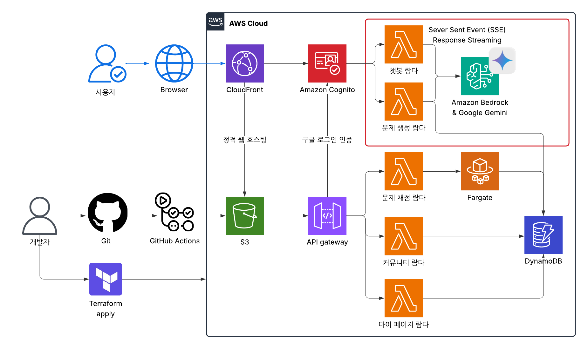
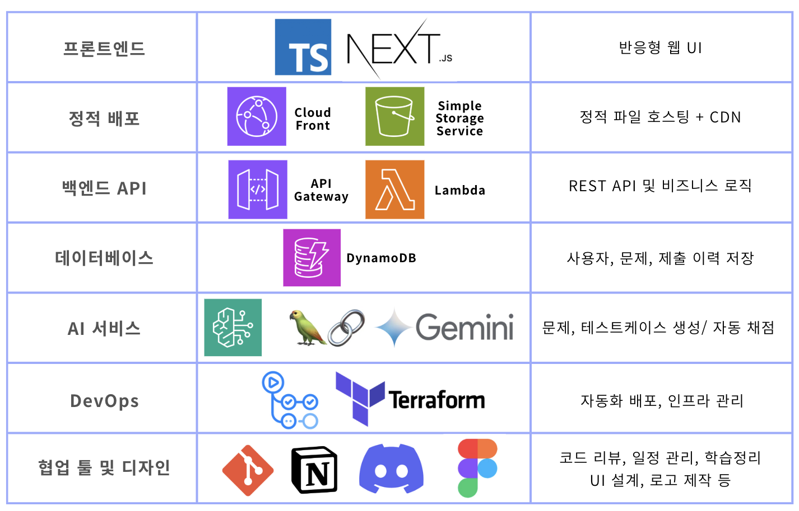

## ALPACO : 클라우드 기반 LLM 알고리즘 문제 생성 및 자동 채점 플랫폼

<p align="center">
  
</p>

### 국민대학교 소프트웨어융합대학 2025년 캡스톤 4팀
---

## 💡 프로젝트 소개

### a. 문제 생성 서비스

- **LLM 기반 맞춤형 알고리즘 문제 생성 (스트리밍 지원)**
  - 사용자가 원하는 주제와 난이도를 입력하면 LLM API(현재 Google Gemini 사용)를 활용하여 고품질의 알고리즘 문제를 실시간 스트리밍 방식으로 생성합니다.
  - 생성 과정(상태 업데이트, 문제 설명 토큰)이 실시간으로 프론트엔드에 전달되어 사용자 경험을 향상시킵니다.
  - 난이도(튜토리얼, 쉬움, 보통, 어려움) 및 사용자 프롬프트를 기반으로 문제 내용, 입출력 형식, 제약 조건, 예제 등을 포함한 완전한 문제 세트를 생성합니다.
  - 생성된 문제에는 사용된 코드 템플릿 정보와 테스트 케이스 생성 코드도 함께 포함됩니다.
  - **기술 스택:** Python, LangChain, AWS Lambda (Streaming Response), Google Gemini
- **유사 문제 추천 기능**
  - 사용자가 문제를 요청했을 때, 이미 유사한 유형의 문제를 다른 사용자가 만든 적이 있다면 이를 안내하고 추천합니다. 기존 문제를 선택하거나 새롭게 생성할지를 사용자에게 물어보고 선택지 부여합니다.

### b. 문제 풀이 및 제출 서비스

- **웹 기반 코드 작성 환경**
  - 사용자는 웹사이트 내에서 제공되는 에디터를 통해 편리하게 코드를 작성하고 즉석에서 문제를 풀 수 있습니다.
- **클라우드 기반 자동 채점 시스템**
  - AWS Lambda와 같은 서버리스 환경을 활용하여 사용자가 제출한 알고리즘 문제를 신속하고 효율적으로 채점합니다.
  - 서버리스 아키텍처 특성상 확장성이 매우 뛰어나며 사용량에 따라 유연하게 과금되므로 비용 효율성 역시 뛰어납니다.

### c. 테스트 케이스 자동 대량 생성

- **LLM을 이용한 대량 테스트 케이스 생성**
  - 문제 난이도와 유형에 최적화된 테스트 케이스를 LLM 기술을 활용하여 자동으로 생성합니다.
  - LLM이 문제에 맞는 테스트 케이스 generator를 생성하여 채점합니다.

### d. 문제 관리 및 사용자 피드백

- **좋아요 기반 추천 시스템**
  - 유저가 문제를 잘 풀고 해당 문제에 '좋아요'를 누르면 데이터베이스에 문제를 자동 저장하고 추가적인 사용자에게 인기 문제로 추천합니다.
- **문제 데이터베이스 관리**
  - 기존 생성된 문제는 사용자들의 평가(좋아요 수)에 따라 품질 점수가 매겨지며, 인기 있는 문제일수록 사용자에게 더 많이 노출됩니다.

### e. Lambda 활용의 적합성

- 서버리스 아키텍처(Lambda)는 채점 작업처럼 트래픽의 변동이 큰 서비스에 매우 적합합니다.
- 평소에는 거의 비용이 들지 않으며, 사용량 증가 시 자동으로 확장되므로 효율적이고 경제적입니다.
- 서버리스 아키텍처(Lambda)는 필요한 경우에만 실행되는 방식으로 에너지를 절약하고 불필요한 자원 낭비를 줄여 환경 친화적인 IT 인프라 운영이 가능합니다.

### f. 서비스 핵심

- 원하는 난이도와 주제로 개별화된 문제를 즉석에서 LLM으로 생성
- 테스트 케이스 생성 자동화로 효율성 향상
- 클라우드 서버리스 환경을 통해 고성능, 저비용 자동 채점 제공
- 기존 문제 활용 및 문제 은행화로 사용자 참여 및 서비스 품질 지속 향상

알고리즘 문제를 맞춤 생성하고, 효율성과 확장성을 고려한 자동 채점 시스템을 제공하여, 사용자 맞춤형 알고리즘 학습 환경을 만들어갑니다.

---

## 주요 기능

---

## 🎬 소개 영상 (예정)

---

## 👋 팀원 소개

<p align="center">
  
</p>

---

## 🌐 시스템 구조

<p align="center">
  
</p>

> LLM 기반 문제 생성부터 채점까지의 전체 흐름을 시각화한 다이어그램입니다.
---

## ⚒️ 기술 스택
<p align="center">
  
</p>

---

## 사용법 (작성중)

소스코드 제출시 설치법이나 사용법을 작성하세요.

(예시: 로컬 개발 환경 설정)

- 프로젝트 루트에 `.env` 파일을 생성하고 필요한 환경 변수(예: `GOOGLE_AI_API_KEY`)를 설정합니다.
- 각 Lambda 함수 디렉토리(예: `backend/lambdas/problem-generator`)의 `requirements.txt` 파일을 사용하여 필요한 Python 라이브러리를 설치합니다.
  ```bash
  pip install -r backend/lambdas/problem-generator/requirements.txt
  pip install -r backend/lambdas/problem-generator-streaming/requirements.txt
  ```

---

## API 명세

### 문제 생성 스트리밍 API

**1. 엔드포인트 정보**

- **HTTP Method:** `POST`
- **Path (예시):** `/generate` (API Gateway에서 설정)
- **기능:** 사용자의 요청(프롬프트, 난이도)을 받아 알고리즘 문제를 실시간 스트리밍 방식으로 생성하고 결과를 반환합니다.

**2. 요청 (Request)**

- **Content-Type:** `application/json`
- **Request Body:**

  ```json
  {
    "prompt": "string (required)",
    "difficulty": "string (required)"
  }
  ```

  - `prompt`: 생성할 문제에 대한 사용자 요구사항 또는 키워드를 포함하는 문자열입니다. (예: "깊이 우선 탐색 기본 문제 만들어줘", "최단 경로 응용 문제")
  - `difficulty`: 생성할 문제의 난이도를 나타내는 문자열입니다. 다음 값 중 하나여야 합니다:
    - `"튜토리얼"`
    - `"쉬움"`
    - `"보통"`
    - `"어려움"`

- **요청 예시:**

  ```json
  {
    "prompt": "정렬 알고리즘을 이용한 쉬운 문제",
    "difficulty": "쉬움"
  }
  ```

**3. 응답 (Response)**

- **Content-Type:** `application/json` (스트리밍 청크 단위)
- **성공 시 (HTTP Status Code: 200):**

  - 응답은 **스트리밍 방식**으로 전달됩니다. 여러 개의 JSON 객체가 순차적으로 전송되며, 각 객체는 개행 문자(`\n`)로 구분됩니다.
  - 프론트엔드에서는 이 스트림을 읽어 각 줄을 JSON으로 파싱하여 처리해야 합니다.
  - 각 JSON 객체는 다음 구조를 따릅니다.

    ```json
    {
      "type": "string",
      "payload": "any"
    }
    ```

    - `type`: 메시지의 종류를 나타냅니다. 가능한 값은 다음과 같습니다.
      - `"status"`: 현재 문제 생성 단계를 나타내는 상태 메시지입니다. `payload`는 상태 설명을 담은 **문자열**입니다. (예: "템플릿 코드 분석 중...", "코드 변형 중...", "✅ 생성 완료!", "❌ 오류 발생")
      - `"token"`: 생성 중인 문제 설명(`description`)의 일부 텍스트 조각입니다. LLM이 생성하는 토큰을 실시간으로 전달합니다. `payload`는 텍스트 **문자열**입니다. 프론트엔드에서는 이 토큰들을 순서대로 이어 붙여 전체 문제 설명을 표시할 수 있습니다.
      - `"result"`: 문제 생성이 최종 완료되었을 때 전송됩니다. `payload`는 생성된 **문제 객체를 요소로 가지는 리스트**입니다. (현재 구현상 리스트에는 항상 하나의 문제 객체만 포함됩니다.) 문제 객체의 상세 구조는 아래 '최종 결과 객체 구조'를 참조하세요.
      - `"error"`: 문제 생성 과정 중 오류가 발생했을 때 전송됩니다. `payload`는 오류 설명을 담은 **문자열**입니다. 이 메시지 이후 스트림이 비정상 종료될 수 있습니다.

  - **최종 결과 객체 구조 (`result` 타입의 `payload` 내부 객체):**

    ```json
    {
      "id": "number", // 생성된 문제의 고유 ID (현재는 해시값 기반 임시 ID)
      "title": "string", // 문제 제목
      "description": "string", // 문제 설명 (스토리텔링 포함 가능)
      "difficulty": "string", // 문제 난이도 ("튜토리얼", "쉬움", "보통", "어려움")
      "input_format": "string", // 입력 형식 설명
      "output_format": "string", // 출력 형식 설명
      "constraints": "array[string]", // 제약 조건 리스트
      "example_input": "object | string", // 예제 입력 (구조는 생성된 테스트 케이스에 따라 달라질 수 있음, 문자열일 수도 있음)
      "example_output": "object | string", // 예제 출력 (구조는 생성된 테스트 케이스에 따라 달라질 수 있음, 문자열일 수도 있음)
      "solution_code": "string", // LLM이 변형한 최종 솔루션 코드 (Python 또는 C++)
      "test_case_generation_code": "string", // 테스트 케이스 생성을 위한 Python 코드 문자열
      "template_source": "string" // 문제 생성에 사용된 템플릿 파일 경로 (예: "dfs/template1.py")
    }
    ```

  - **응답 스트림 예시:**

    ````
    {"type": "status", "payload": "요청 분석 시작: '정렬 알고리즘...' (쉬움)"}\n
    {"type": "status", "payload": "알고리즘 유형 감지됨: '정렬'"}\n
    {"type": "status", "payload": "템플릿 파일 불러오는 중..."}\n
    {"type": "status", "payload": "템플릿 코드 분석 중..."}\n
    {"type": "status", "payload": "코드 변형 중..."}\n
    {"type": "status", "payload": "문제 설명 생성 스트리밍 시작..."}\n
    {"type": "token", "payload": "```json\\\\n{\\\\n  \\\\"problem_title\\\\":"}\n
    {"type": "token", "payload": " \\\\"숫자 카드 놀이\\\\",\\\\n  \\\\"description\\\\":"}\n
    {"type": "token", "payload": " \\\\"영희는 친구들과 숫자 카드 놀이를 하고 있습니다."}\n
    ... (더 많은 token 메시지) ...\n
    {"type": "token", "payload": " \\\\"\\\\n}\\\\n```"}\n
    {"type": "status", "payload": "테스트 케이스 생성 중..."}\n
    {"type": "status", "payload": "최종 결과 통합 및 포맷팅 중..."}\n
    {"type": "result", "payload": [{"id": 12345, "title": "숫자 카드 놀이", "description": "...", "difficulty": "쉬움", ...}]}\n
    {"type": "status", "payload": "✅ 생성 완료!"}\n
    ````

- **오류 시 (HTTP Status Code):**
  - **4xx (클라이언트 오류):** 요청 형식이 잘못되었거나 필수 필드가 누락된 경우 API Gateway 레벨 또는 Lambda 함수 초기 검증 단계에서 발생할 수 있습니다. (예: `{"message": "Missing required field: prompt"}`)
  - **5xx (서버 오류):** Lambda 함수 실행 중 예기치 않은 오류 발생 시. 하지만 현재 구현은 대부분의 내부 오류를 스트림 내 `"error"` 타입 메시지로 보내고 스트림을 종료하려고 시도합니다. 따라서 5xx 오류보다는 스트림 내 `"error"` 메시지를 주로 확인해야 합니다.

**4. 인증/인가**

- 현재 Lambda 함수 자체에는 별도의 사용자 인증/인가 로직이 없습니다.
- API Gateway 레벨에서 API Key, IAM 권한, Cognito 등을 사용하여 접근 제어를 설정할 수 있습니다.

**5. 로컬 테스트 예시 (cURL)**

(AWS SAM 또는 Docker RIE 등으로 로컬에 API Gateway 에뮬레이터가 실행 중이라고 가정, 예: `http://127.0.0.1:3000`)

````bash
curl -N -X POST http://127.0.0.1:3000/generate \\\
-H "Content-Type: application/json" \\\
-d \'{\n  "prompt": "그래프 탐색 기본 문제",\n  "difficulty": "보통"\n}\'\n```

*   `-N` 옵션은 버퍼링 없이 스트리밍 출력을 바로 확인하기 위해 사용됩니다.

---

## 6. 기타

추가적인 내용은 자유롭게 작성하세요.

### 프로젝트 구조

```shell
/project-root
  /infrastructure        # IaC 코드 (CDK, CloudFormation, Terraform)
  /backend
    /lambdas             # Lambda 함수 코드 (예시)
      /problem-generator
      /submission-handler
      /auto-grader
  /frontend              # nextjs 등의 프론트엔드 코드
  /database              # 데이터베이스 스키마, 마이그레이션
  /api                   # API 정의 (OpenAPI 스펙)
  /scripts               # 배포 스크립트 등
````
