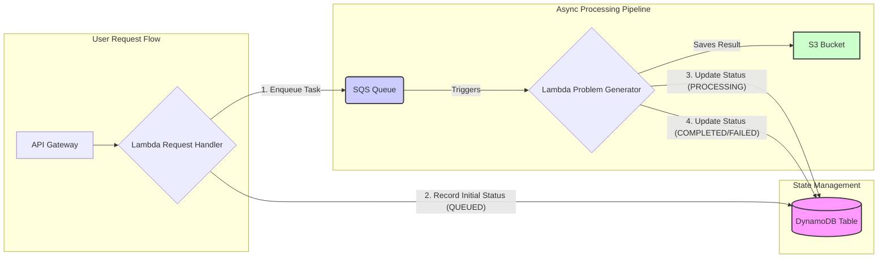

# Problem Generator AWS 서버리스 구현

이 프로젝트는 별도의 `problem-generator` 모듈을 AWS 서버리스 환경에서 실행하고 관리하기 위한 래퍼(wrapper) 및 오케스트레이터(orchestrator)입니다.
알고리즘 문제 생성 요청을 받아 SQS를 통해 비동기적으로 처리하고, DynamoDB로 작업 상태를 추적하며, 결과는 S3에 저장합니다.

## 목차

- [아키텍처 설명](#아키텍처-설명)
- [시스템 구성 요소](#시스템-구성-요소)
- [설치 및 설정](#설치-및-설정)
- [로컬 테스트](#로컬-테스트)
- [AWS 배포 방법](#aws-배포-방법)
- [API 사용 방법](#api-사용-방법)
- [AWS 서비스 명세](#aws-서비스-명세)
  - [DynamoDB 명세](#dynamodb-명세)
  - [S3 명세](#s3-명세)
- [문제 해결](#문제-해결)

## 아키텍처 설명

이 시스템은 다음과 같은 아키텍처로 구성되어 있습니다:



### 처리 흐름

1. **요청 처리 단계**:

   - API Gateway를 통해 사용자로부터 문제 생성 요청 수신
   - Lambda(Request Handler)가 요청을 검증하고 SQS 큐에 작업 등록
   - **DynamoDB에 작업 상태를 `QUEUED`로 초기화**
   - 사용자에게 작업 ID와 추후 결과를 확인할 수 있는 URL 반환

2. **문제 생성 단계**:
   - Lambda(Problem Generator)가 SQS 큐에서 작업을 가져와 처리
   - **DynamoDB의 작업 상태를 `PROCESSING`으로 업데이트**
   - (`problem-generator` 모듈 호출) LLM을 이용하여 알고리즘 문제를 생성
   - 생성된 문제를 S3에 저장
   - **DynamoDB의 작업 상태를 `COMPLETED` (또는 오류 시 `FAILED`)로 업데이트**
   - 처리 완료된 메시지를 SQS에서 삭제

이 아키텍처는 다음과 같은 이점을 제공합니다:

- **확장성**: 요청이 증가하더라도 SQS를 통한 버퍼링으로 안정적인 처리 가능
- **비용 효율성**: 서버리스 아키텍처로 필요한 경우에만 자원 사용
- **견고성**: 문제 생성 실패 시에도 시스템 전체 안정성 유지
- **분리된 관심사**: 요청 처리와 문제 생성 로직의 분리

## 시스템 구성 요소

### 핵심 컴포넌트

1. **Request Handler Lambda**

   - 사용자 요청 검증
   - 작업 ID 생성
   - SQS 메시지 등록

2. **Problem Generator Lambda**

   - SQS 메시지 처리
   - LLM 연동을 통한 문제 생성
   - S3에 결과 저장

3. **AWS 서비스**
   - **Amazon SQS**: 작업 대기열 관리
   - **Amazon S3**: 생성된 문제 저장
   - **Amazon DynamoDB**: 작업 상태 추적 및 관리
   - **Amazon API Gateway**: API 엔드포인트 제공

### 파일 구조

```
problem-generator-aws/
├── config.py               # 설정 파일
├── local_simulate.py       # 로컬 테스트 스크립트
├── requirements.txt        # 의존성 패키지 목록
├── lambdas/
│   ├── request_handler/    # 요청 처리 Lambda
│   │   └── lambda_function.py
│   └── problem_generator/  # 문제 생성 Lambda
│       └── lambda_function.py
└── dynamodb_schemas/       # DynamoDB 테이블 스키마 예시 (선택적)
    └── job_status.json
└── utils/
    └── aws_utils.py        # AWS 서비스 유틸리티 함수
```

## 설치 및 설정

### 사전 요구사항

- Python 3.8 이상
- AWS CLI (로컬 테스트 및 배포용)
- Docker 및 Docker Compose (LocalStack 실행용)

### Docker 설치

#### macOS

```bash
# Homebrew를 이용한 설치
brew install --cask docker

# Docker 실행
open /Applications/Docker.app
```

#### Ubuntu/Debian

```bash
# 필요한 패키지 설치
sudo apt-get update
sudo apt-get install docker.io docker-compose

# Docker 서비스 실행
sudo systemctl start docker
sudo systemctl enable docker

# 사용자를 docker 그룹에 추가 (sudo 없이 실행하기 위해)
sudo usermod -aG docker $USER
```

#### Windows

1. [Docker Desktop for Windows](https://hub.docker.com/editions/community/docker-ce-desktop-windows/)에서 설치 파일을 다운로드하여 실행
2. WSL2 지원을 활성화하라는 안내에 따라 설정

### 의존성 패키지 설치

```bash
pip install -r requirements.txt
```

### 환경 변수 설정

프로젝트의 루트 디렉토리에 `.env` 파일을 생성하고 다음 설정을 추가하세요:

```bash
# Google AI API 키 설정 (필수)
export GOOGLE_AI_API_KEY="your-api-key-here"

# DynamoDB 테이블 이름 (선택 사항, 기본값: problem-job-status)
export DYNAMODB_TABLE_NAME="problem-job-status"

# SQS 큐 이름 (선택 사항, 기본값: problem-generator-queue)
export SQS_QUEUE_NAME="problem-generator-queue"

# S3 버킷 이름 (선택 사항, 기본값: problem-generator-results)
export S3_BUCKET_NAME="problem-generator-results"

# 로컬 테스트용 설정
export IS_LOCAL="true"
export LOCALSTACK_HOSTNAME="localhost"
export LOCALSTACK_PORT="4566"
```

## 로컬 테스트

### LocalStack 시작

docker-compose를 사용하여 LocalStack을 실행할 수 있습니다:

```bash
# docker-compose.yml 파일이 있는 디렉토리에서 실행
docker-compose up -d
```

또는 Docker 명령어를 직접 사용할 수도 있습니다:

```bash
docker run --rm -it -p 4566:4566 -p 4571:4571 localstack/localstack
```

### AWS 리소스 초기화

```bash
python local_simulate.py --setup
```

### 문제 생성 요청 테스트

```bash
# 기본 옵션으로 실행
python local_simulate.py

# 특정 알고리즘 및 난이도 지정
python local_simulate.py -a "그래프" -d "보통"

# API 키 직접 지정
python local_simulate.py -a "다이나믹 프로그래밍" -d "어려움" -k "your-api-key"
```

## AWS 배포 방법

### Lambda 함수 패키징

```bash
# Lambda 레이어용 패키지 생성
mkdir -p package/python
pip install -r requirements.txt -t package/python
cd package && zip -r ../lambda-layer.zip python/ && cd ..

# Lambda 함수 코드 패키징
mkdir -p deployment
cp -r lambdas utils config.py *.py deployment/
cd deployment && zip -r ../request-handler.zip lambdas/request_handler/ utils/ config.py && cd ..
cd deployment && zip -r ../problem-generator.zip lambdas/problem_generator/ utils/ config.py && cd ..
```

### AWS CLI를 이용한 수동 배포

1. **Lambda 레이어 생성**:

```bash
aws lambda publish-layer-version \
    --layer-name problem-generator-dependencies \
    --zip-file fileb://lambda-layer.zip \
    --compatible-runtimes python3.8 python3.9
```

2. **IAM 역할 생성**:

AWS 콘솔에서 Lambda 함수에 필요한 권한을 가진 IAM 역할을 생성하세요:

- AWSLambdaBasicExecutionRole
- AmazonSQSFullAccess
- AmazonS3FullAccess
- AmazonDynamoDBFullAccess (또는 더 제한적인 권한: dynamodb:PutItem, dynamodb:UpdateItem, dynamodb:GetItem)

3. **Lambda 함수 생성**:

```bash
# 요청 처리 Lambda (환경 변수 DYNAMODB_TABLE_NAME, SQS_QUEUE_NAME 추가 권장)
aws lambda create-function \
    --function-name problem-request-handler \
    --runtime python3.9 \
    --handler lambdas.request_handler.lambda_function.handler \
    --role arn:aws:iam::<YOUR_ACCOUNT_ID>:role/<YOUR_ROLE_NAME> \
    --zip-file fileb://request-handler.zip \
    --layers arn:aws:lambda:<YOUR_REGION>:<YOUR_ACCOUNT_ID>:layer:problem-generator-dependencies:<VERSION> \
    --timeout 10 \
    --memory-size 128 \
    --environment "Variables={GOOGLE_AI_API_KEY=<YOUR_API_KEY>,DYNAMODB_TABLE_NAME=$DYNAMODB_TABLE_NAME,SQS_QUEUE_NAME=$SQS_QUEUE_NAME}"

# 문제 생성 Lambda (환경 변수 DYNAMODB_TABLE_NAME, S3_BUCKET_NAME 추가 권장)
aws lambda create-function \
    --function-name problem-generator-worker \
    --runtime python3.9 \
    --handler lambdas.problem_generator.lambda_function.handler \
    --role arn:aws:iam::<YOUR_ACCOUNT_ID>:role/<YOUR_ROLE_NAME> \
    --zip-file fileb://problem-generator.zip \
    --layers arn:aws:lambda:<YOUR_REGION>:<YOUR_ACCOUNT_ID>:layer:problem-generator-dependencies:<VERSION> \
    --timeout 900 \
    --memory-size 2048 \
    --environment "Variables={GOOGLE_AI_API_KEY=<YOUR_API_KEY>,DYNAMODB_TABLE_NAME=$DYNAMODB_TABLE_NAME,S3_BUCKET_NAME=$S3_BUCKET_NAME}"
```

4. **SQS 큐 생성**:

```bash
aws sqs create-queue --queue-name ${SQS_QUEUE_NAME:-problem-generator-queue}
```

5. **S3 버킷 생성**:

```bash
aws s3 mb s3://${S3_BUCKET_NAME:-problem-generator-results}
```

6. **DynamoDB 테이블 생성**:

```bash
aws dynamodb create-table \
    --table-name ${DYNAMODB_TABLE_NAME:-problem-job-status} \
    --attribute-definitions AttributeName=problemId,AttributeType=S \
    --key-schema AttributeName=problemId,KeyType=HASH \
    --provisioned-throughput ReadCapacityUnits=1,WriteCapacityUnits=1
```

7. **Lambda 트리거 설정**:

```bash
# SQS에서 Lambda 트리거 설정
aws lambda create-event-source-mapping \
    --function-name problem-generator-worker \
    --event-source-arn arn:aws:sqs:<YOUR_REGION>:<YOUR_ACCOUNT_ID>:problem-generator-queue \
    --batch-size 1
```

8. **API Gateway 설정**:

AWS 콘솔에서 API Gateway를 설정하고 요청 처리 Lambda를 연결하세요.

## API 사용 방법

### 문제 생성 요청

**엔드포인트**: `POST /generate`

**요청 본문**:

```json
{
  "algorithm_type": "그래프",
  "difficulty": "보통",
  "api_key": "your-api-key-here" // 선택 사항, 환경 변수로 설정 가능
}
```

**응답 예시**:

```json
{
  "problemId": "550e8400-e29b-41d4-a716-446655440000",
  "status": "QUEUED",
  "algorithm_type": "그래프",
  "difficulty": "보통",
  "result_url": "https://problem-generator-results.s3.amazonaws.com/results/550e8400-e29b-41d4-a716-446655440000.json",
  "message_id": "abcdef12-3456-7890-abcd-ef1234567890" // SQS Message ID
}
```

### 결과 확인

생성이 완료되면 `result_url`에서 결과를 확인할 수 있습니다. S3에서 파일을 다운로드하여 내용을 확인하세요.
또한, DynamoDB 테이블에서 `problemId`를 사용하여 작업의 최종 상태(`COMPLETED` 또는 `FAILED`)와 결과 URL 또는 오류 메시지를 확인할 수 있습니다.

## AWS 서비스 명세

### DynamoDB 명세

DynamoDB는 작업 상태 추적을 위해 사용되며, 다음과 같은 테이블 구조를 가집니다:

#### 테이블 명: `problem-job-status` (또는 환경 변수 `DYNAMODB_TABLE_NAME`으로 설정)

**테이블 구조:**

| 속성                     | 유형              | 설명                                              |
| ------------------------ | ----------------- | ------------------------------------------------- |
| `problemId`              | String (기본 키)  | 작업의 고유 식별자 (UUID)                         |
| `status`                 | String            | 작업 상태 (QUEUED, PROCESSING, COMPLETED, FAILED) |
| `algorithm_type`         | String            | 문제 생성에 사용된 알고리즘 유형                  |
| `difficulty`             | String            | 문제 난이도 (쉬움, 보통, 어려움)                  |
| `request_timestamp`      | String (ISO 8601) | 요청이 처음 접수된 시간                           |
| `last_updated_timestamp` | String (ISO 8601) | 상태가 마지막으로 업데이트된 시간                 |
| `result_url`             | String (nullable) | 생성된 문제가 저장된 S3 URL                       |
| `error_message`          | String (nullable) | 오류 발생 시 오류 메시지                          |

**상태 값:**

- `QUEUED`: SQS에 작업이 등록되고 처리 대기 중
- `PROCESSING`: Lambda에서 문제 생성이 진행 중
- `COMPLETED`: 문제 생성이 완료되고 S3에 결과가 저장됨
- `FAILED`: 처리 중 오류가 발생함

**사용 패턴:**

1. **초기화**: 작업 요청 시 `add_job_status(problemId, algorithm_type, difficulty)` 호출

   ```python
   # 새 작업 상태 생성 예제
   problemId = str(uuid.uuid4())
   add_job_status(problemId, "그래프", "보통")
   ```

2. **상태 업데이트**: 처리 과정에 따라 `update_job_status(problemId, new_status, result_url=None, error_message=None)` 호출

   ```python
   # 처리 시작 시
   update_job_status(problemId, "PROCESSING")

   # 성공적 완료 시
   update_job_status(problemId, "COMPLETED", result_url="https://bucket-name.s3.amazonaws.com/key")

   # 오류 발생 시
   update_job_status(problemId, "FAILED", error_message="Error message here")
   ```

3. **상태 조회**: `get_job_status(problemId)` 호출로 현재 상태 확인
   ```python
   # 상태 조회 예제
   status = get_job_status(problemId)
   print(f"Current status: {status['status']}")
   ```

### S3 명세

S3는 생성된 문제를 JSON 형식으로 저장하는 데 사용됩니다:

#### 버킷 명: `problem-generator-results` (또는 환경 변수 `S3_BUCKET_NAME`으로 설정)

**객체 구조:**

- **키 형식**: `results/{problemId}.json`
- **콘텐츠 타입**: `application/json`

**JSON 구조:**

생성된 문제 JSON은 다음 필드를 포함합니다:

```json
{
  "title": "문제 제목",
  "description": "문제 설명 텍스트",
  "constraints": "문제 제약조건",
  "input_format": "입력 형식 설명",
  "output_format": "출력 형식 설명",
  "examples": [
    {
      "input": "예제 입력 데이터",
      "output": "예제 출력 데이터"
    }
  ],
  "solution_code": "문제 해결을 위한 코드",
  "test_cases": [
    {
      "input": "테스트 케이스 입력",
      "output": "테스트 케이스 출력"
    }
  ],
  "test_generator_code": "테스트 케이스 생성 코드",
  "algorithm_type": "알고리즘 유형",
  "difficulty": "난이도"
}
```

**사용 패턴:**

1. **업로드**: `upload_to_s3(content, object_key, content_type)` 함수 사용

   ```python
   # 문제 JSON 업로드 예제
   object_key = f"results/{problemId}.json"
   result_url = upload_to_s3(problem_result, object_key, 'application/json')
   ```

2. **URL 생성**: `generate_s3_url(object_key)` 함수로 결과 URL 생성

   ```python
   # S3 URL 생성 예제
   object_key = f"results/{problemId}.json"
   url = generate_s3_url(object_key)
   ```

3. **로컬 테스트**: LocalStack에서는 URL 형식이 `http://localhost:4566/bucket-name/key`로 반환됩니다.

## 문제 해결

### 일반적인 문제

1. **"API key is required" 오류**:

   - 환경 변수 `GOOGLE_AI_API_KEY`가 설정되어 있는지 확인
   - 요청에 `api_key` 필드 추가

2. **LocalStack 연결 문제**:

   - "Could not connect to the endpoint URL" 오류가 발생하면:
     - Docker가 실행 중인지 확인 (Docker Desktop이 실행 중이어야 함)
     - `docker ps` 명령어로 LocalStack 컨테이너가 실행 중인지 확인
     - LocalStack 컨테이너가 실행되지 않은 경우 `docker-compose up -d` 명령어로 시작
     - `curl http://localhost:4566/health` 로 LocalStack 상태 확인

3. **Docker 관련 문제**:

   - "Cannot connect to the Docker daemon" 오류는 Docker 서비스가 실행되지 않았음을 의미
   - Docker Desktop 앱이 실행되어 있는지 확인하고, 완전히 시작될 때까지 기다린 후 다시 시도
   - macOS의 경우: `open -a Docker` 명령어로 Docker Desktop 시작
   - Linux의 경우: `sudo systemctl start docker` 명령어로 Docker 서비스 시작

4. **Lambda 임포트 오류**:

   - Lambda의 파이썬 패키지 경로 문제일 수 있음
   - 배포 패키지에 모든 필요한 파일이 포함되었는지 확인

5. **SQS 메시지 처리 문제**:
   - CloudWatch 로그에서 Lambda 실행 로그 확인
   - SQS 데드레터 큐 설정 고려
   - DynamoDB 테이블에서 작업 상태가 `PROCESSING`에서 멈춰 있는지 확인

### Lambda 타임아웃 해결

문제 생성 Lambda는 LLM 호출로 시간이 오래 걸릴 수 있습니다. 필요에 따라 타임아웃 값을 최대 15분으로 늘리세요.

```bash
aws lambda update-function-configuration \
    --function-name problem-generator-worker \
    --timeout 900
```

---

## 향후 개선 사항

1. **상태 조회 API**: DynamoDB에 저장된 작업 상태를 조회하는 API 엔드포인트 추가
2. **웹훅 알림**: 문제 생성 완료 시 웹훅을 통한 알림 기능
3. **세분화된 상태 관리**: DynamoDB에 `current_step` 필드를 추가하여 `PROCESSING` 상태를 더 세분화 (예: `ANALYZING_TEMPLATE`, `TRANSFORMING_CODE`, `GENERATING_DESCRIPTION`, `GENERATING_TESTCASES`)
4. **간소화된 배포**: AWS SAM 또는 CloudFormation 템플릿 개발
5. **LLM 응답 스트리밍**: (복잡도 높음) WebSocket을 사용하여 특정 단계의 LLM 응답을 프론트엔드로 실시간 스트리밍
