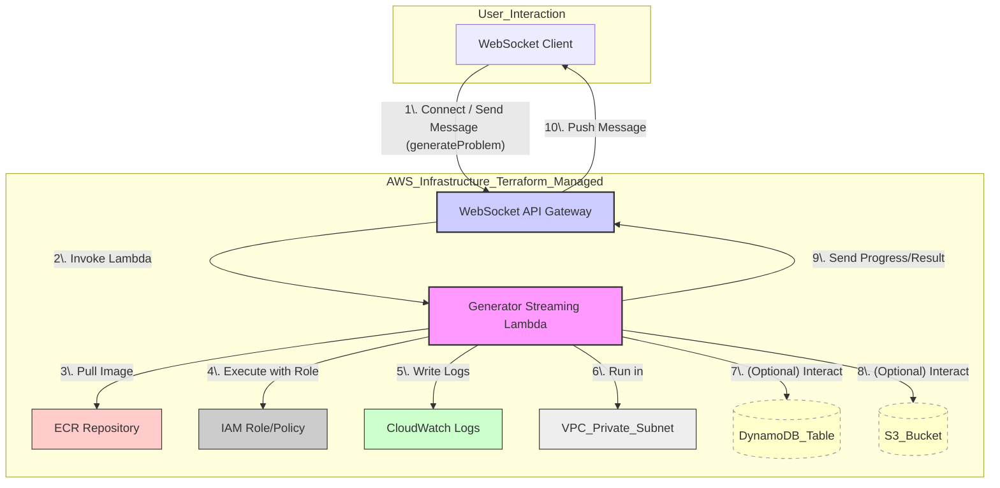

# 문제 생성 스트리밍 Lambda 함수 인프라 (Terraform 연동)

이 문서는 Alpaco 프로젝트의 "문제 생성 스트리밍" Lambda 함수(`generator_streaming_lambda`)와 관련된 AWS 인프라 구성, Terraform을 사용한 배포 과정, 그리고 발생했던 문제 및 해결 과정을 상세히 설명합니다.

## 1. Lambda 함수의 역할

이 Lambda 함수는 다음과 같은 핵심 기능을 수행합니다.

- **문제 생성 요청 처리:** WebSocket API를 통해 사용자의 문제 생성 요청 (예: 프롬프트, 문제 ID)을 받습니다.
- **문제 생성 로직 실행:** 내부적으로 문제 생성 로직(관련 Python 모듈 활용, 예: `generation` 모듈)을 실행합니다.
- **실시간 스트리밍:** 문제 생성 과정의 진행 상황이나 결과를 연결된 WebSocket 클라이언트에게 실시간으로 전송합니다.

이 함수는 Docker 컨테이너 이미지 기반으로 배포되어, 필요한 라이브러리와 코드를 패키징하여 실행 환경의 일관성을 유지합니다.

## 아키텍처 다이어그램

아래 다이어그램은 사용자의 문제 생성 요청이 처리되는 과정을 시각적으로 보여줍니다.



이 다이어그램은 주요 구성 요소 간의 데이터 흐름과 의존성을 보여줍니다.

- 클라이언트는 WebSocket API Gateway를 통해 Lambda 함수와 상호작용합니다.
- Lambda 함수는 ECR에서 Docker 이미지를 가져와 실행되며, IAM 역할을 통해 다른 AWS 서비스(CloudWatch Logs 등)에 접근합니다.
- VPC 내에서 실행되어 네트워크 보안을 확보합니다.
- (선택 사항) 문제 생성 로직에 따라 DynamoDB나 S3와 상호작용할 수 있습니다.

---

## 2. 관련 Terraform 리소스 (`infrastructure/terraform/problem_service/`)

`infrastructure/terraform/problem_service/` 디렉토리에 정의된 Terraform 코드 중 이 Lambda 함수와 직접적으로 관련된 주요 리소스는 다음과 같습니다.

- **`aws_lambda_function.generator_streaming_lambda` (`api_lambda.tf`):**
  - Lambda 함수 자체를 정의합니다.
  - `package_type = "Image"` 로 설정되어 Docker 이미지 기반임을 명시합니다.
  - `image_uri` 를 통해 ECR에 저장된 특정 버전의 Docker 이미지를 참조합니다.
  - `role` 에 `aws_iam_role.generator_streaming_lambda_role` 을 연결하여 필요한 권한을 부여받습니다.
  - `vpc_config` 를 통해 VPC 내의 프라이빗 서브넷에서 실행되도록 설정하여 보안을 강화합니다. (예: 외부 서비스 접근 제어)
- **`aws_ecr_repository.generator_streaming_repo` (`ecr.tf`):**
  - 이 Lambda 함수의 Docker 이미지를 저장하고 관리하기 위한 전용 ECR 리포지토리를 생성합니다.
  - Terraform은 이 리포지토리의 URI를 `aws_lambda_function` 정의에 사용합니다.
- **`aws_iam_role.generator_streaming_lambda_role` (`iam.tf`):**
  - Lambda 함수가 실행 중에 다른 AWS 서비스(CloudWatch Logs, ECR, DynamoDB, S3 등)에 접근하는 데 필요한 권한을 부여하는 IAM 역할입니다.
- **`aws_iam_policy.generator_streaming_lambda_policy` (`iam.tf`):**
  - 위 역할에 연결될 구체적인 권한 정책입니다. CloudWatch 로그 작성, ECR 이미지 풀링, DynamoDB 테이블 접근 등에 필요한 액션을 정의합니다.
- **`aws_apigatewayv2_api.generator_streaming_api` (`api_lambda.tf`):**
  - 클라이언트가 이 Lambda 함수와 통신할 수 있는 WebSocket API 엔드포인트를 생성합니다.
- **`aws_apigatewayv2_route` / `aws_apigatewayv2_integration` (`api_lambda.tf`):**
  - WebSocket API 로 들어오는 특정 메시지(예: `$connect`, `$disconnect`, `generateProblem` 액션)를 `generator_streaming_lambda` 함수와 연결하여 처리하도록 라우팅 및 통합 설정을 정의합니다.
- **`aws_lambda_permission` (`api_lambda.tf`):**
  - API Gateway가 `generator_streaming_lambda` 함수를 호출(invoke)할 수 있도록 권한을 부여합니다.

## 3. 배포 절차 (Lambda 함수 중심)

이 Lambda 함수를 포함한 전체 인프라 배포는 Terraform으로 관리되지만, Lambda 함수의 코드를 업데이트하는 과정은 다음과 같습니다.

1.  **Lambda 코드 수정:** `backend/lambdas/problem-generator-streaming/` 디렉토리 내의 Python 코드 (`lambda_function.py` 및 관련 모듈)를 수정합니다.
2.  **Docker 이미지 빌드 및 푸시:** 수정된 코드를 포함하여 고유 태그(예: 타임스탬프)를 사용하여 새 Docker 이미지를 빌드하고 ECR에 푸시합니다. 로컬 환경에서는 `--platform linux/amd64` 플래그 사용이 필수적입니다.

    ```bash
    # 예시: backend/lambdas/ 디렉토리에서 실행

    # 고유 태그 생성 (Timestamp)
    TAG=$(date +%Y%m%d%H%M%S)
    echo "Using tag: $TAG"

    # ECR 리포지토리 URI 확인 (필요시)
    # REPO_URL=$(terraform -chdir=../../infrastructure/terraform/problem_service output -raw generator_streaming_ecr_repo_url)
    REPO_URL="<AWS_ACCOUNT_ID>.dkr.ecr.ap-northeast-2.amazonaws.com/alpaco/problem-generator-streaming-dev" # 실제 URL로 대체 필요

    # Docker 로그인 (필요시)
    # aws ecr get-login-password --region ap-northeast-2 | docker login --username AWS --password-stdin $REPO_URL

    # 이미지 빌드 (Dockerfile 위치 및 빌드 컨텍스트 주의)
    docker build --platform linux/amd64 -t alpaco/problem-generator-streaming-dev:$TAG -f problem-generator-streaming/Dockerfile .

    # ECR 주소로 이미지 태그 지정
    docker tag alpaco/problem-generator-streaming-dev:$TAG $REPO_URL:$TAG

    # ECR로 이미지 푸시
    docker push $REPO_URL:$TAG
    ```

3.  **Terraform 적용 (`terraform apply`):** `infrastructure/terraform/problem_service` 디렉토리에서 `terraform apply` 를 실행하여 Lambda 함수를 업데이트합니다. 이때 `-var` 옵션을 사용하여 새 이미지 태그를 전달해야 합니다.
    ```bash
    # 이전 단계에서 생성한 태그($TAG)를 사용
    terraform apply -var="generator_streaming_image_tag=$TAG" -auto-approve
    ```

## 4. 문제 해결 기록 (이 Lambda 함수 관련)

이 Lambda 함수를 배포하고 테스트하는 과정에서 다음과 같은 주요 문제들이 발생했습니다.

1.  **Lambda 소스 이미지를 찾을 수 없음 (초기):** (해결됨)
    - **오류:** `terraform apply` 시 `InvalidParameterValueException: Source image ...:latest does not exist.`
    - **원인:** ECR 리포지토리에 `:latest` 태그가 붙은 이미지가 푸시되지 않았음.
    - **해결:** `Dockerfile` 정의 및 이미지 빌드/푸시.
2.  **Lambda 소스 이미지 미디어 타입 미지원:** (해결됨)
    - **오류:** 이미지를 푸시한 후 `terraform apply` 또는 AWS 콘솔에서 함수 생성 시 `InvalidParameterValueException: The image manifest, config or layer media type ... is not supported.`
    - **원인:** 로컬 macOS 환경에서 빌드된 Docker 이미지 형식이 AWS Lambda 실행 환경과 호환되지 않음.
    - **해결:** 로컬 빌드 시 `--platform linux/amd64` 플래그 사용. (또는 CloudShell 사용)
3.  **Lambda 소스 이미지를 찾을 수 없음 (Destroy/재푸시 후):** (해결됨)
    - **오류:** `terraform destroy` 후 CloudShell에서 이미지를 다시 푸시했음에도 `apply` 시 "Source image ... does not exist" 오류 재발생.
    - **원인:** Lambda 함수의 실행 역할에 필요한 ECR 권한 누락.
    - **해결:** `iam.tf` 에 ECR 권한 추가.
4.  **`terraform apply` 시 Lambda 업데이트 안됨:** (해결됨)
    - **오류:** ECR에 새 이미지를 `:latest` 태그로 푸시한 후 `terraform apply`를 실행해도 Lambda 함수가 업데이트되지 않음 (`No changes`).
    - **원인:** Terraform은 이미지 내용 변경이 아닌 `image_uri` (태그 포함) 변경을 기준으로 업데이트를 감지함. `:latest` 태그는 이름이 변경되지 않음.
    - **해결:** 고유한 이미지 태그(타임스탬프, Git 해시 등) 사용 및 Terraform 변수(`generator_streaming_image_tag`)를 통해 `image_uri`를 동적으로 설정하도록 변경. `terraform apply` 시 `-var` 옵션으로 태그 전달.
5.  **"Internal server error" (WebSocket 테스트 중):**
    - **오류:** `wscat` 으로 WebSocket 연결 후 `generateProblem` 메시지 전송 시 Lambda 함수 로그에 오류 발생.
    - **세부 오류 1 (CloudWatch 로그):** `TypeError: unsupported operand type(s) for |: 'type' and 'NoneType'` (해결됨)
      - **원인:** Lambda 함수 런타임의 Python 버전(3.9 이하 추정)이 파이썬 3.10+ 타입 힌트 문법(`|`)을 지원하지 않음.
      - **해결:** 타입 힌트를 `Union[str, None]` 으로 수정.
    - **세부 오류 2 (CloudWatch 로그):** `ImportError: No module named 'generation'` (해결됨)
      - **원인:** `generation` 모듈이 Docker 이미지 빌드 시 포함되지 않음.
      - **해결:** `Dockerfile` 수정 (`COPY` 명령어 추가 및 빌드 컨텍스트 조정) 및 `lambda_function.py` 의 `sys.path` 수정.

## 5. 현재 상태 및 다음 단계

Lambda 함수 코드 오류(`TypeError`, `ImportError`) 및 배포 방식(`:latest` 태그 문제)을 해결하기 위한 수정 사항이 적용되었습니다. Terraform 구성도 고유 태그를 사용하도록 업데이트되었습니다.

다음 단계는 다음과 같습니다.

1.  수정된 코드와 `Dockerfile`을 사용하여 **고유 태그로 Docker 이미지를 다시 빌드하고 ECR에 푸시**.
2.  `terraform apply -var="generator_streaming_image_tag=<YOUR_NEW_TAG>" -auto-approve` 명령을 사용하여 **Lambda 함수 업데이트**.
3.  `wscat` 또는 다른 WebSocket 클라이언트를 사용하여 **기능 재테스트**.
