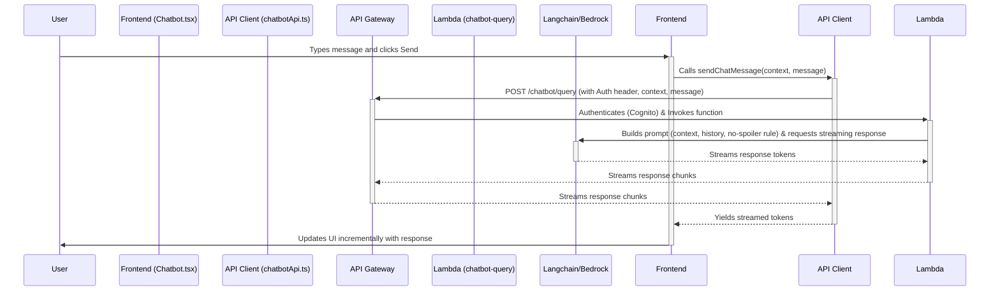

# Feature Specification: AI Chatbot Assistant

**Version:** 1.0
**Date:** 2025-04-13
**Author:** pwh9882

## 1. Overview

This document provides the technical specification for the AI Chatbot Assistant feature integrated into the ALPACO coding test solve page. It details the frontend components, backend API, data flow, infrastructure, and deployment process. Refer to `chatbot-prd.md` for user requirements and goals.

## 2. Architecture

The feature follows a client-server architecture with a streaming backend:

1. **Frontend:** A React component (`Chatbot.tsx`) within the existing `/coding-test/solve` page handles UI, state, and communication with the backend.
2. **Backend:** An AWS Lambda function (`chatbot-query`) exposed via API Gateway processes requests, interacts with an LLM via Langchain, and streams responses.
3. **API Gateway:** Manages routing, authentication (Cognito), and proxying requests to the Lambda function.
4. **LLM:** An AWS Bedrock model (e.g., Claude) accessed via Langchain generates the conversational responses.
5. **Authentication:** AWS Cognito, integrated with API Gateway, verifies user identity using JWT tokens provided by the frontend (Amplify).



## 3. Frontend Implementation (`frontend/`)

### 3.1 Component: `src/components/Chatbot.tsx`

- **Purpose:** Replaces the placeholder `RightSidebar` in `solve/page.tsx`. Manages the chat UI and interaction logic.
- **State:**
  - `messages`: Array of chat messages (`{ role: 'user' | 'assistant', content: string }[]`).
  - `userInput`: Current content of the input field.
  - `isLoading`: Boolean indicating if waiting for a response.
  - `streamingResponse`: String holding the currently streaming response part.
- **Props:**
  - `problemDetails`: `ProblemDetail` object (passed down from `CodingTestContent`).
  - `userCode`: Current code string (passed down from `CodingTestContent`).
- **Functionality:**
  - Renders the chat history (`messages` + `streamingResponse`).
  - Renders the text input and send button.
  - Handles user input changes.
  - On send:
    - Adds user message to `messages`.
    - Sets `isLoading` to true.
    - Calls the API client function (`chatbotApi.sendChatMessage`).
    - Passes `problemDetails`, `userCode`, current `messages` history, and `userInput`.
    - Processes the async generator returned by the API client:
      - Appends incoming tokens to `streamingResponse`.
    - On stream completion:
      - Adds the complete `streamingResponse` as an 'assistant' message to `messages`.
      - Clears `streamingResponse`.
      - Sets `isLoading` to false.
  - Handles potential API errors.

### 3.2 API Client: `src/api/chatbotApi.ts`

- **Purpose:** Encapsulates communication with the backend chatbot API.
- **Function: `sendChatMessage(context: ChatContext, message: string): AsyncGenerator<string, void, undefined>`**
  - `ChatContext`: Interface containing `problemDetails`, `userCode`, `history`.
  - Retrieves the Cognito JWT ID token using Amplify's `fetchAuthSession`.
  - Constructs the JSON payload including context and the new message.
  - Makes a `POST` request to the `/chatbot/query` endpoint with the `Authorization: Bearer <token>` header.
  - Uses `fetch` API with appropriate headers.
  - **Crucially:** Processes the streaming response body (e.g., using `ReadableStream` and `TextDecoder`).
  - Parses each chunk (assuming newline-delimited JSON objects like `{"token": "..."}` or similar).
  - Yields the `token` string from each chunk.
  - Handles network errors and non-200 status codes.

## 4. Backend Implementation (`backend/lambdas/chatbot-query/`)

### 4.1 Lambda Function (`lambda_function.py`)

- **Runtime:** Python 3.9+
- **Handler:** `lambda_handler`
- **Dependencies:** `langchain`, `boto3`, `langchain_aws` (for Bedrock integration). (Managed via `requirements.txt`).
- **Environment Variables:**
  - `BEDROCK_MODEL_ID`: ID of the Bedrock model to use (e.g., `anthropic.claude-v2:1`).
  - `AWS_REGION`: AWS region for Bedrock.
- **Logic:**
  1. **Parse Input:** Extract `problemDetails`, `userCode`, `history`, and `newMessage` from the API Gateway event body.
  2. **Authentication Context:** (Optional but recommended) Log the username from `event.requestContext.authorizer.claims['cognito:username']`.
  3. **Build Prompt:**
     - Construct a system prompt emphasizing the role of a helpful assistant and the **strict "no spoilers" rule**.
     - Format the chat history (`history`) and the new user message (`newMessage`).
     - Include relevant parts of `problemDetails` and `userCode` within the prompt context. Be mindful of token limits. Consider summarizing or selecting relevant parts if context is large.
  4. **Initialize Langchain:**
     - Set up the Bedrock LLM client using `boto3`.
     - Initialize the Langchain Bedrock chat model (`ChatBedrock`) with `streaming=True`.
  5. **Invoke LLM Stream:** Call the LLM's `stream()` method with the constructed prompt/messages.
  6. **Stream Response:**
     - Iterate through the response stream from Langchain.
     - For each chunk/token received:
       - Format it into a JSON string (e.g., `{"token": "..."}\n`).
       - Yield/return this chunk using Lambda's streaming response mechanism (requires function URL or specific API Gateway integration setup for streaming). _Initial implementation might use standard response if streaming setup is complex, but streaming is preferred._

### 4.2 Dependencies (`requirements.txt`)

```
boto3>=1.34.0
langchain>=0.1.0
langchain_aws>=0.1.0 # Or langchain-community if using older Bedrock integration
# Add other necessary libraries
```

## 5. Infrastructure (`infrastructure/chatbot/`)

- **Terraform Files:** `main.tf`, `variables.tf`, `outputs.tf`, `backend.tf`, `iam.tf`, `lambda.tf`, `apigateway.tf`.
- **Backend:** Configure S3 backend with a unique key (e.g., `chatbot/terraform.tfstate`).
- **`iam.tf`:**
  - `aws_iam_role` for the Lambda function.
  - `aws_iam_policy` granting:
    - Basic Lambda execution (`AWSLambdaBasicExecutionRole`).
    - Bedrock model invocation (`bedrock:InvokeModel`, `bedrock:InvokeModelWithResponseStream`).
- **`lambda.tf`:**
  - `data "archive_file"` to zip the Lambda code.
  - `aws_lambda_function` resource:
    - Reference the IAM role.
    - Set runtime, handler, memory, timeout.
    - Define environment variables (`BEDROCK_MODEL_ID`, `AWS_REGION`).
    - _If using Lambda Function URL for streaming:_ Configure `function_url` block.
- **`apigateway.tf`:**
  - Reference the API Gateway created in `infrastructure/api` or create a new one if desired.
  - `aws_api_gateway_resource` for `/chatbot` and `/chatbot/query`.
  - `aws_api_gateway_method` for `POST /chatbot/query`.
    - Set `authorization = "COGNITO_USER_POOLS"`.
    - Reference the Cognito authorizer from the `api` infrastructure (using `data "terraform_remote_state"`).
  - `aws_api_gateway_integration` linking the POST method to the Lambda function (`AWS_PROXY`). _Note: Standard proxy integration might not directly support response streaming back to the client easily. May need Lambda Function URL or WebSocket API Gateway for robust streaming._
  - `aws_lambda_permission` allowing API Gateway to invoke the Lambda.
  - `aws_api_gateway_method` and related resources for `OPTIONS /chatbot/query` to handle CORS preflight requests.
- **`outputs.tf`:** Output the API Gateway invoke URL for the chatbot endpoint.

**Streaming Consideration:** Achieving true end-to-end streaming from Bedrock -> Lambda -> API Gateway -> Frontend requires careful configuration.
**\*Option 1 (Lambda Function URL):** Configure Lambda with `invoke_mode = "RESPONSE_STREAM"` and use its Function URL directly from the frontend (requires CORS config on Lambda URL). API Gateway might only be used for authentication discovery or bypassed. \* **Option 2 (API Gateway HTTP API):** HTTP APIs have better native support for Lambda streaming responses than REST APIs. Might require migrating the API.
**\*Option 3 (API Gateway REST API - Workaround):** Might involve chunked transfer encoding, but less straightforward. \* **Initial Fallback:** If streaming proves complex initially, return the full response from Lambda first, and implement streaming as an enhancement.

## 6. Deployment (`.github/workflows/deploy-chatbot.yml`)

- **Trigger:** On push to `main` (or other designated branch) affecting `backend/lambdas/chatbot-query/**` or `infrastructure/chatbot/**`.
- **Jobs:**
  - `deploy-infrastructure`:
    - Checkout code.
    - Setup Python, install dependencies (`requirements.txt`) for Lambda packaging (if needed locally before zipping, though Terraform's `archive_file` handles basic zipping).
    - Configure AWS Credentials (OIDC).
    - Setup Terraform.
    - Run `terraform init` (with backend config for `chatbot/`).
    - Run `terraform plan`.
    - Run `terraform apply` (on target branch push).
- **Secrets:** Requires secrets similar to `deploy-api.yml` but potentially a different IAM role ARN if finer-grained permissions are desired (`AWS_IAM_ROLE_ARN_CHATBOT`, `TF_STATE_BUCKET`, `TF_STATE_LOCK_TABLE`, `AWS_REGION`).

## 7. Data Schema

- **Chat History:** Array of objects: `{ role: 'user' | 'assistant', content: string }` (Managed in frontend state for v1.0).
- **API Request Payload:**

  ```json
  {
    "problemDetails": { ... }, // ProblemDetail structure from codingTestApi.ts
    "userCode": "...",        // String
    "history": [              // Array of { role: 'user' | 'assistant', content: string }
      { "role": "user", "content": "..." },
      { "role": "assistant", "content": "..." }
    ],
    "newMessage": "..."       // String (User's latest input)
  }
  ```

- **API Response Stream Chunk (Example):**

  ```json
  {"token": "Dijkstra's"}
  {"token": " algorithm"}
  {"token": " is"}
  {"token": " used..."}
  ```

  _(Exact format depends on Lambda implementation)_

## 8. Error Handling

- **Frontend:** Display user-friendly messages for API errors (network, authentication, server-side). Handle stream interruptions.
- **Backend:** Catch errors during LLM interaction or processing. Return appropriate error messages (potentially within the stream using an `{"error": "..."}` format). Log detailed errors to CloudWatch.
- **API Gateway:** Configure standard error responses.
