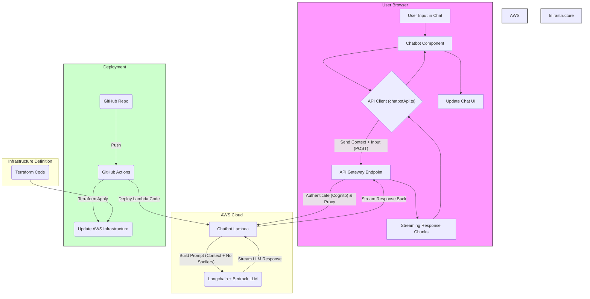

# Plan Summary: AI Chatbot Assistant

**Version:** 1.0
**Date:** 2025-04-13
**Author:** pwh9882

## 1. Objective

Implement an AI-powered chatbot assistant within the coding test solving page (`/coding-test/solve`) to provide contextual, non-spoiling help to users. The chatbot will leverage AWS Lambda, Langchain, an LLM (e.g., Bedrock), and API Gateway, with infrastructure managed by Terraform and deployment automated via GitHub Actions.

## 2. High-Level Plan

1. **Documentation:** Create detailed Feature Specification, Product Requirements Document (PRD), and a trackable To-Do list. (Completed: `chatbot-prd.md`, `chatbot-feature-spec.md`, `chatbot-todo.md`)
2. **Frontend Implementation:**
   - Develop the chat UI within the `RightSidebar` area (new `Chatbot.tsx` component).
   - Implement state management for chat history and UI states.
   - Create an API client (`chatbotApi.ts`) to handle authenticated, streaming requests, passing problem details, user code, and chat history.
3. **Backend Implementation:**
   - Create a new Lambda function (`backend/lambdas/chatbot-query/`) using Python and Langchain.
   - Implement logic to receive context, build a non-spoiling prompt, interact with a streaming LLM (e.g., Bedrock), and stream the response back.
4. **Infrastructure (Terraform):**
   - Create a new Terraform configuration (`infrastructure/chatbot/`).
   - Define resources: Lambda function, API Gateway endpoint (POST `/chatbot/query` with Cognito Auth), IAM Role/Policy (Bedrock access), CORS configuration.
   - Configure S3/DynamoDB backend for Terraform state.
5. **Deployment (GitHub Actions):**
   - Create or update a GitHub Actions workflow (`.github/workflows/deploy-chatbot.yml`) for automated backend/infrastructure deployment triggered by code changes.
6. **Integration & Testing:** Connect frontend and backend, perform end-to-end testing.

## 3. Data Flow Diagram

## 4. Key Considerations

- **Streaming:** Implementing end-to-end streaming requires careful configuration (Lambda Function URL or API Gateway HTTP API preferred).
- **Spoiler Prevention:** Prompt engineering is critical to ensure the chatbot provides helpful hints without giving away solutions.
- **Context Management:** Handling potentially large context (code, history, problem details) within LLM token limits needs consideration.
- **Authentication:** API Gateway must correctly integrate with Cognito for securing the endpoint.

## 5. Next Steps

With the plan documented, the next phase involves implementing the backend, infrastructure, frontend, and deployment automation as detailed in `docs/chatbot-todo.md`.
