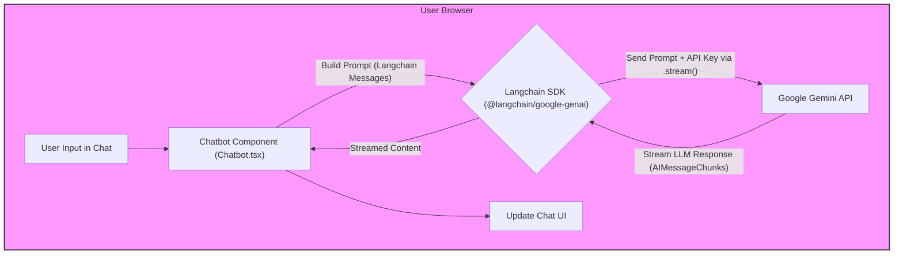

# Plan Summary: AI Chatbot Assistant (Client-Side Gemini)

**Version:** 2.0
**Date:** 2025-04-13
**Author:** pwh9882

## 1. Objective

Implement an AI-powered chatbot assistant within the coding test solving page (`/coding-test/solve`) using a **client-side approach**. The chatbot will run directly in the user's browser, leveraging the **Google Generative AI SDK** to interact with a **Gemini model** (e.g., Gemini Pro) via an API key. This approach eliminates the need for dedicated backend infrastructure (Lambda, API Gateway) for the chatbot functionality.

## 2. High-Level Plan

1.  **Documentation:** Update Feature Specification, PRD, and To-Do list to reflect the client-side architecture. (In Progress)
2.  **API Key Setup:** Obtain a Google AI API key for the Gemini model and configure it securely for the frontend (e.g., via `NEXT_PUBLIC_` environment variable, acknowledging security implications).
3.  **Frontend Implementation:**
    - Update the existing `Chatbot.tsx` component.
    - Install and integrate the **`@langchain/google-genai`** SDK (and `langchain` core if needed).
    - Implement logic within `Chatbot.tsx` to:
      - Gather context (problem details, user code, history).
      - Construct a non-spoiling prompt suitable for Gemini using Langchain message formats.
      - Call the Langchain Gemini model's `.stream()` method using the SDK and API key.
    - Remove the backend API client (`chatbotApi.ts`).
4.  **Backend/Infrastructure Removal:**
    - Delete the `backend/lambdas/chatbot-query/` directory and its contents.
    - Delete the `infrastructure/chatbot/` directory and its contents.
    - Remove any related deployment steps from GitHub Actions workflows (e.g., `deploy-chatbot.yml`).
5.  **Integration & Testing:** Test the client-side chatbot interaction, streaming, and error handling thoroughly.

## 3. Data Flow Diagram

## 4. Key Considerations

- **API Key Security:** Storing and using API keys on the client-side requires careful consideration. Using `NEXT_PUBLIC_` environment variables makes the key visible in the browser's source code. For production, a backend proxy or other more secure methods might be needed, but for this project phase, we'll proceed with the environment variable approach.
- **Client-Side Performance:** All processing (prompt building, API calls, stream handling) occurs in the user's browser. Performance impact should be monitored.
- **Spoiler Prevention:** Prompt engineering remains critical to ensure the chatbot provides helpful hints without giving away solutions.
- **Context Management:** Handling potentially large context (code, history, problem details) within LLM token limits still needs consideration, now managed entirely by the frontend.

## 5. Next Steps

Update the remaining documentation (Feature Spec, PRD, To-Do), configure the API key, remove backend/infrastructure, and implement the client-side Gemini integration in `Chatbot.tsx`.
