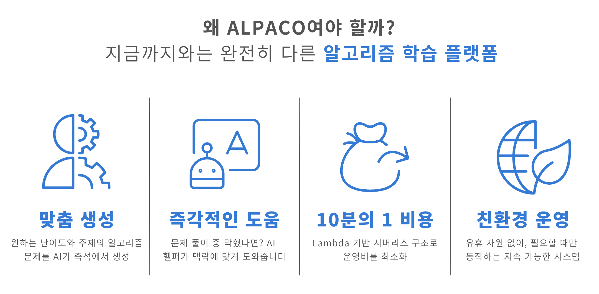
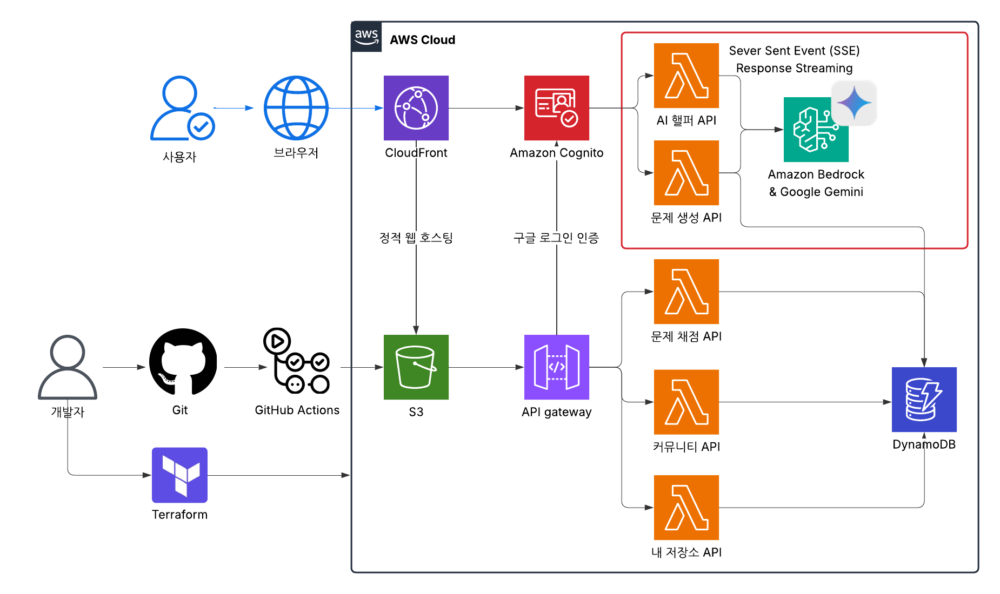
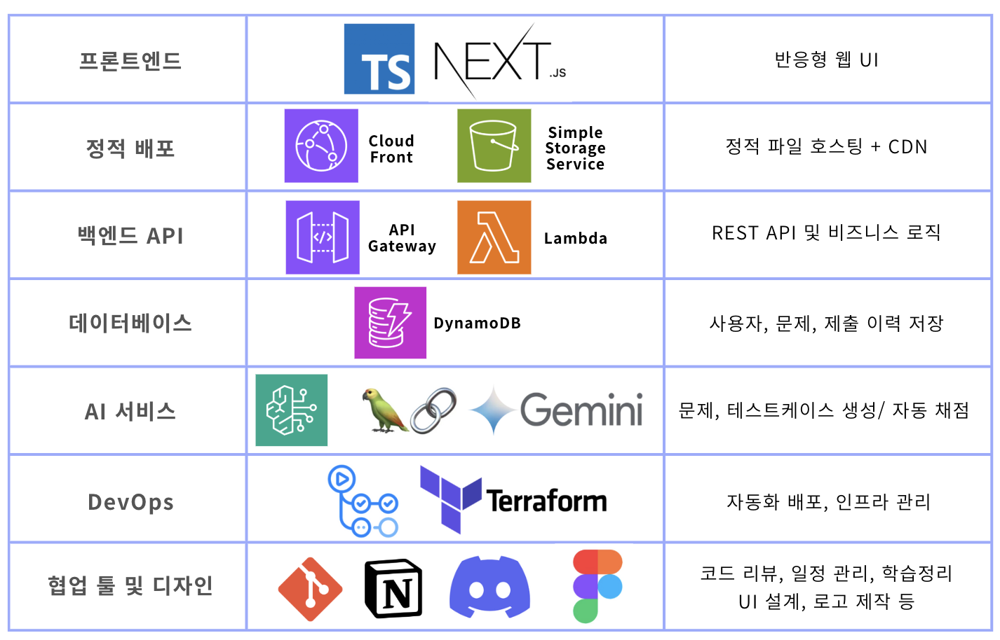

## ALPACO : 클라우드 기반 LLM 알고리즘 문제 생성 및 자동 채점 플랫폼
{: .no_toc }

<br/><br/>

<p align="center">
  
</p>

<br/><br/>

---

## 🔗 목차
{: .no_toc .text-delta }

1. TOC
{:toc}

---


## 💡 프로젝트 소개

<p align="center">
  
</p>

### 이제 문제는 '고르는' 것이 아니라 '생성하는' 것입니다
{: .no_toc }

- ALPACO는 사용자의 입력에 따라 AI가 문제를 즉석에서 생성하고 풀이 중엔 AI 헬퍼가 상황을 인식해 실시간 도움을 줍니다.
- AWS Lambda 기반으로 필요할 때만 작동하는 서버리스 구조를 채택해 전력 낭비 없이 운영됩니다.
- 문제 생성부터 풀이, 피드백, 기록, 공유까지 알고리즘 학습의 전 과정을 하나의 AI 기반 서버리스 생태계에 담았습니다.

---

## 🚀 주요 기능

### ✏️ 코딩 테스트
{: .no_toc }

- LLM 기반 알고리즘 문제 자동 생성 (주제 + 난이도 입력)
- 웹 기반 코드 에디터에서 문제 풀이
- 자동 채점 시스템을 통해 즉시 채점 결과 확인

### 🤖 AI 헬퍼
{: .no_toc }

- 사용자의 코딩 테스트 상황을 실시간으로 인식
- 힌트 요청 시 문제 맥락에 맞는 설명, 유사 문제, 알고리즘 개념을 자동 추천
- 사용자에게 이해 중심 피드백 ****제공 (예: “이 문제는 DFS를 써야 해요!”)

### 📁 내 저장소
{: .no_toc }

- 사용자가 생성한 문제 목록을 한눈에 확인
- 다시 풀기, 문제 은행화 가능

### 💬 커뮤니티
{: .no_toc }

- 생성된 문제에 대해 사용자들끼리 댓글, 의견 공유
- 문제 퀄리티 개선을 위한 참여형 피드백 시스템

### 📊 채점 현황 보드
{: .no_toc }

- 전체 제출 기록을 문제별 / 사용자별 / 조합별로 필터링
- 최신순 + 페이지네이션 기능
- 추후 사용자 통계 및 랭킹 시스템으로 확장 가능

---

## 🎬 소개 영상

**(예정)**

---

## 👋 팀원 소개

<p align="center">
  
</p>

---

## 🌐 시스템 구조

<p align="center">
  
</p>

> LLM 기반 문제 생성부터 채점까지의 전체 흐름을 시각화한 다이어그램입니다.
{: .no_toc }
---

## ⚒️ 기술 스택

<p align="center">
  
</p>

---

## 📖 사용법 (작성중)

소스코드 제출시 설치법이나 사용법을 작성하세요.

(예시: 로컬 개발 환경 설정)

- 프로젝트 루트에 `.env` 파일을 생성하고 필요한 환경 변수(예: `GOOGLE_AI_API_KEY`)를 설정합니다.
- 각 Lambda 함수 디렉토리(예: `backend/lambdas/problem-generator`)의 `requirements.txt` 파일을 사용하여 필요한 Python 라이브러리를 설치합니다.

  ```bash
  pip install -r backend/lambdas/problem-generator/requirements.txt
  pip install -r backend/lambdas/problem-generator-streaming/requirements.txt
  ```

---

## 📂 폴더 구조

---

## 📝 참고 자료
